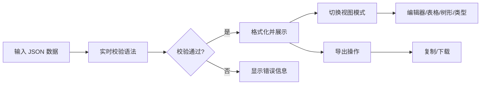

## 1. 产品概述

JSON Formatter 是一个在线 JSON 格式化与校验工具，帮助开发者快速格式化、压缩、校验和可视化 JSON 数据。参考 json.site 的设计理念，提供简洁高效的用户体验。

- 核心价值：让 JSON 数据处理变得简单直观
- 目标用户：前端/后端开发者、测试人员、数据分析师
- 主要功能：JSON 格式化、压缩、校验、多视图展示、导入导出

## 2. 核心功能

### 2.1 用户角色

| 角色 | 注册方式 | 核心权限 |
|------|----------|----------|
| 访客用户 | 无需注册 | 使用所有 JSON 处理功能 |

### 2.2 功能模块

1. **编辑器视图**：左侧输入、右侧格式化输出，实时语法高亮
2. **表格视图**：将 JSON 数据以表格形式展示
3. **树形视图**：可折叠的树形结构展示 JSON 数据
4. **类型视图**：展示 JSON 各字段的数据类型

### 2.3 页面详情

| 页面名称 | 模块名称 | 功能描述 |
|-----------|-------------|---------------------|
| 主页面 | 顶部工具栏 | 视图切换、上传、下载、复制、格式化、压缩、撤销、重做、搜索、设置 |
| 主页面 | 左侧编辑区 | JSON 文本输入，带行号和语法高亮 |
| 主页面 | 右侧展示区 | 格式化后的 JSON 输出，支持多种视图切换 |
| 主页面 | 底部状态栏 | 语言、字体大小、缩进设置、字符统计 |

## 3. 核心流程

用户在左侧输入 JSON 数据 → 系统自动校验并格式化 → 右侧展示格式化结果 → 用户可切换不同视图 → 支持复制、下载等操作

## 4. 用户界面设计

### 4.1 设计风格

- 主色调：深灰背景 + 白色内容区，简洁专业的开发者工具风格
- 强调色：蓝色系用于高亮和交互元素
- 语法高亮：键名紫色、字符串绿色、数字蓝色、布尔值橙色
- 布局：左右分栏布局，顶部工具栏，底部状态栏
- 字体：等宽字体用于代码展示，保证对齐和可读性
- 风格：简洁、专业、高效，面向开发者的工具美学

### 4.2 页面设计概览

| 页面名称 | 模块名称 | UI 元素 |
|-----------|-------------|-------------|
| 主页面 | 顶部工具栏 | 图标按钮组、视图切换标签、搜索框 |
| 主页面 | 编辑区 | 行号、代码编辑器、语法高亮、错误提示 |
| 主页面 | 展示区 | 折叠/展开、语法高亮、多种视图 |
| 主页面 | 状态栏 | 语言选择、字体大小、缩进设置、统计信息 |

### 4.3 响应式

- 桌面端：左右分栏布局
- 平板端：上下布局，编辑区在上，展示区在下
- 移动端：垂直布局，简化工具栏

### 4.4 动效设计

- 视图切换：平滑淡入淡出过渡
- 按钮悬停：微妙的背景色变化
- 错误提示：红色边框闪烁提示
- 折叠展开：平滑的高度过渡动画
