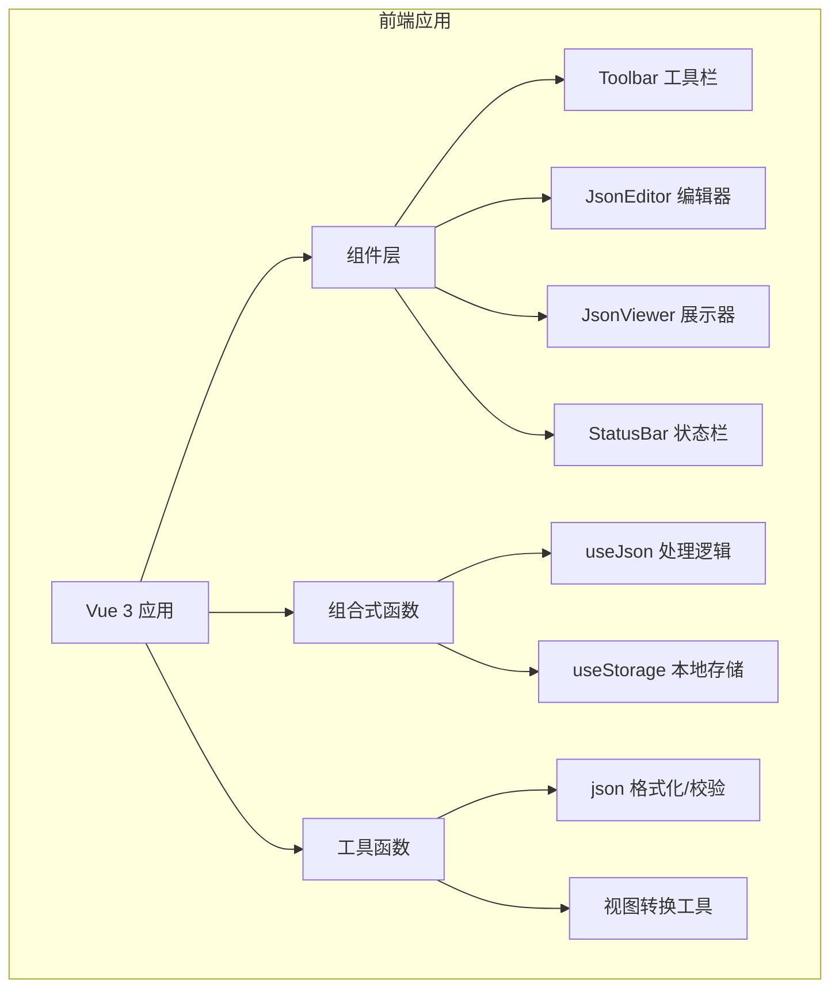

## 1. 架构设计



## 2. 技术说明

- 前端框架：Vue 3 + TypeScript + Vite
- 样式方案：Tailwind CSS 3
- 状态管理：Vue Composition API + reactive
- 代码编辑器：CodeMirror 6（轻量、高性能）
- 图标库：Lucide Vue
- 部署：GitHub Pages

## 3. 项目结构

```
/workspace
├── src/
│   ├── components/
│   │   ├── Toolbar.vue          # 顶部工具栏
│   │   ├── JsonEditor.vue       # JSON 输入编辑器
│   │   ├── JsonViewer.vue       # JSON 展示器（多视图）
│   │   ├── TableView.vue        # 表格视图
│   │   ├── TreeView.vue         # 树形视图
│   │   ├── TypeView.vue         # 类型视图
│   │   └── StatusBar.vue        # 底部状态栏
│   ├── composables/
│   │   ├── useJson.ts           # JSON 处理逻辑
│   │   └── useSettings.ts       # 设置管理
│   ├── utils/
│   │   ├── json.ts              # JSON 工具函数
│   │   └── format.ts            # 格式化工具
│   ├── App.vue                  # 主应用组件
│   ├── main.ts                  # 入口文件
│   └── style.css                # 全局样式
├── public/
├── index.html
├── package.json
├── vite.config.ts
├── tsconfig.json
├── tailwind.config.js
└── postcss.config.js
```

## 4. 路由定义

| 路由 | 用途 |
|-------|---------|
| / | 主页面，JSON 格式化工具 |

本项目为单页应用，无需多路由。

## 5. 核心数据结构

```typescript
interface JsonSettings {
  indentSize: number;       // 缩进空格数
  fontSize: number;         // 字体大小
  theme: 'light' | 'dark';  // 主题
  language: 'zh' | 'en';    // 语言
}

interface JsonState {
  input: string;            // 输入的 JSON 字符串
  parsed: any;              // 解析后的 JSON 对象
  error: string | null;     // 错误信息
  viewMode: 'editor' | 'table' | 'tree' | 'type'; // 视图模式
}
```

## 6. 部署方案

- 构建命令：`npm run build`
- 输出目录：`dist/`
- 部署方式：GitHub Pages + GitHub Actions 自动部署
- 访问地址：`https://<username>.github.io/json-formatter/`
